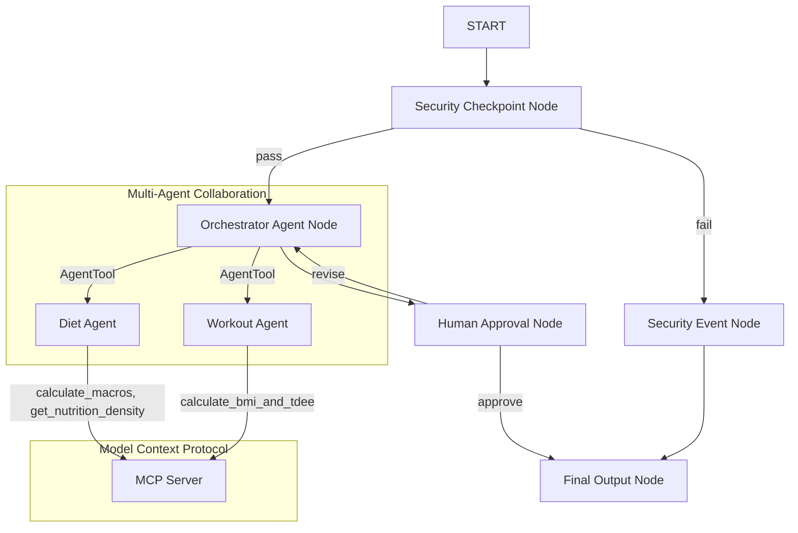

# Submission Write-Up: Diet & Fitness Concierge (`diet-fit-concierge`)

## Problem Statement
Living a healthy lifestyle requires balancing diet planning, nutritional checks, cooking preparation, and exercising. Managing these variables is overwhelming for most individuals. Existing solutions are fragmented, lack customizability, and do not verify data safety or security. 
`diet-fit-concierge` provides a unified, secure, intelligent, and interactive concierge agent that designs complete daily nutritional and fitness regimes while protecting user privacy and ensuring safe boundaries.

## Solution Architecture

## Concepts Used

- **ADK Workflow (Graph-based API):** Implemented in [agent.py](file:///c:/Users/asdfg/Desktop/agent%20ai/adk-%20workspace/diet-fit-concierge/app/agent.py). Coordinates the graph states, nodes, and edges.
- **LlmAgent:** Declared in [agent.py](file:///c:/Users/asdfg/Desktop/agent%20ai/adk-%20workspace/diet-fit-concierge/app/agent.py#L67) for the three specialized roles (`orchestrator_agent`, `diet_agent`, `workout_agent`).
- **AgentTool:** Used in [agent.py](file:///c:/Users/asdfg/Desktop/agent%20ai/adk-%20workspace/diet-fit-concierge/app/agent.py#L128) to allow `orchestrator_agent` to delegate work to `diet_agent` and `workout_agent`.
- **MCP Server:** Implemented in [mcp_server.py](file:///c:/Users/asdfg/Desktop/agent%20ai/adk-%20workspace/diet-fit-concierge/app/mcp_server.py) using stdio transport. Exposes specialized calculations and queries.
- **Security Checkpoint:** Implemented as `security_checkpoint()` in [agent.py](file:///c:/Users/asdfg/Desktop/agent%20ai/adk-%20workspace/diet-fit-concierge/app/agent.py#L139) to sanitize inputs and enforce domain safety rules.
- **Agents CLI:** Scaffolding and deployment targets initialized and managed through `agents-cli`.

## Security Design

1. **Multi-Category PII Scrubbing:** Strips emails, telephone numbers, credit cards, SSN, and insurance codes using standard regex. This is critical in fitness contexts where users might accidentally input private information.
2. **Prompt Injection Guardrails:** Scans incoming user messages for known exploit injection phrases (e.g., "ignore previous instructions") to prevent prompt bypass.
3. **Structured JSON Audit Logging:** Outputs structured logs to standard streams for SIEM and indexing systems, keeping a transparent record of all security decisions (INFO, WARNING, CRITICAL).
4. **Underage COPPA Gate:** Automatically blocks queries from children under 13 years of age.
5. **Medical Boundary Filter:** Restricts the system from prescribing medications (like Ozempic) or diagnosing diseases, ensuring the agent remains a general wellness advisor rather than a replacement for medical professionals.

## MCP Server Design
The local Model Context Protocol server exposes three tools:
1. `calculate_bmi_and_tdee`: Takes raw body statistics and provides metabolic rates to align workouts with body requirements.
2. `calculate_macros`: Breaks down daily targets into protein, carb, and fat requirements based on nutritional type (keto, high-protein, balanced, low-fat).
3. `get_nutrition_density`: Acts as a local reference cache for common food products.

## Human-in-the-Loop (HITL) Flow
To make the agent safe and cooperative, a `human_approval` node checks if the user approves the proposed daily regimen. 
- The workflow pauses and yields a `RequestInput` asking: *"Do you approve this plan? Enter 'yes' or describe changes you'd like."*
- If the user provides feedback (e.g. "remove dairy"), the edge redirects back to the `orchestrator_agent` to revise the schedule, ensuring users are always in control before a final output is committed.

## Demo Walkthrough
Refer to the three test cases in the [README.md](file:///c:/Users/asdfg/Desktop/agent%20ai/adk-%20workspace/diet-fit-concierge/README.md#sample-test-cases):
1. **Case 1:** Generates the plan draft and pauses for approval.
2. **Case 2:** Submits feedback and recalculates the updated plan.
3. **Case 3:** Demonstrates injection detection and blocks the request with a structured log warning.

## Impact / Value Statement
`diet-fit-concierge` streamlines health and lifestyle tracking. Busy professionals, gym enthusiasts, and individuals aiming for active lifestyle transformations get a structured, customized nutrition and workout guide in seconds. By implementing safety gates, users are protected from privacy leaks and clinical diagnosis errors.
